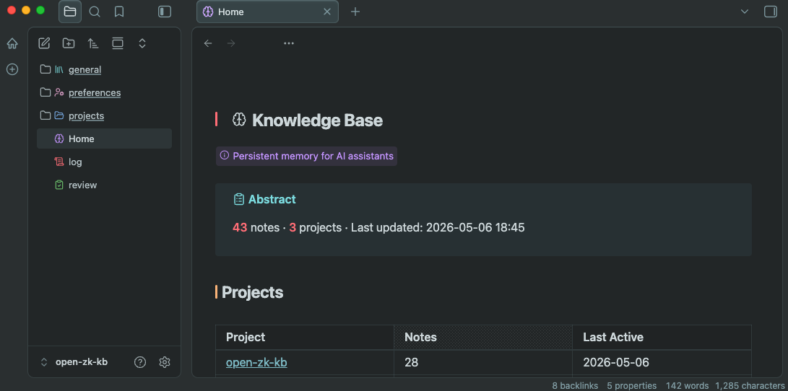

# open-zk-kb

[](https://github.com/mrosnerr/open-zk-kb/actions/workflows/ci.yml)
[](https://www.npmjs.com/package/open-zk-kb)
[](https://www.npmjs.com/package/open-zk-kb)
[](https://opensource.org/licenses/MIT)

Shared, persistent memory for AI assistants, built on the Zettelkasten method. One knowledge base for all your tools — so context persists across sessions and clients.

## Demo

<p align="center">
  
  <br>
  <sub>Real MCP calls — store, search, and stats run against a live knowledge base.</sub>
</p>

<p align="center">
  
  <br>
  <sub>Browse your knowledge base in Obsidian — homepage dashboard with project stats and navigation.</sub>
</p>

## Why open-zk-kb?

AI assistants forget everything between sessions. open-zk-kb gives your assistant a persistent, structured memory it queries automatically.

- **Hybrid search** — full-text + [local embeddings](docs/configuration.md#embeddings-local-first), so only relevant notes surface
- **Atomic notes** — one concept per note ([9 kinds](docs/note-lifecycle.md#note-kinds--defaults), [lifecycle management](docs/note-lifecycle.md)) keeps results precise
- **Local-first** — no API keys, works offline, scales to thousands of notes
- **Human-readable** — Markdown + YAML frontmatter, [rebuildable from files](docs/architecture.md#dual-storage-model)
- **Obsidian-native** — [browse your knowledge graph](docs/obsidian.md), navigate by kind, and explore connections visually
- **Shared memory across tools** — one knowledge base for [OpenCode, Claude Code, Cursor, Windsurf, and Zed](docs/setup-guide.md)
- **MIT-licensed**

## Quick Start

> **Requires [Bun](https://bun.sh)** — install with `curl -fsSL https://bun.sh/install | bash`

```bash
bunx open-zk-kb@latest
```

That's it. The interactive installer:
1. Adds the MCP server to your client config
2. Installs knowledge base instructions (skill for Claude Code, managed block for OpenCode/Windsurf)
3. Creates a local vault at `~/.local/share/open-zk-kb`

Supported clients: **OpenCode**, **Claude Code**, **Cursor**, **Windsurf**, **Zed**

See the [Setup Guide](docs/setup-guide.md) for manual installation, client-specific configs, and troubleshooting.

## Configuration

Zero configuration required. The installer creates `~/.config/open-zk-kb/config.yaml` with sensible defaults — local embeddings work out of the box with no API key.

See the [Configuration Reference](docs/configuration.md) for embeddings, vault path, lifecycle tuning, and Obsidian scaffold options.

## Development

```bash
git clone https://github.com/mrosnerr/open-zk-kb
cd open-zk-kb
bun install && bun run build
bun run setup            # interactive installer
```

## Documentation

- [Setup Guide](docs/setup-guide.md) — installation, manual config, client-specific setup, troubleshooting
- [Tools Reference](docs/tools-reference.md) — all 8 MCP tools with parameters and examples
- [Note Lifecycle](docs/note-lifecycle.md) — 9 note kinds, statuses, review system, promotion
- [Configuration](docs/configuration.md) — embeddings, vault, logging, Obsidian scaffold
- [Obsidian Guide](docs/obsidian.md) — managed scaffold, 14 plugins, navigation, screenshots
- [Architecture](docs/architecture.md) — dual storage, ownership model, design decisions
- [Development](docs/development.md) — local dev, testing, debugging, adding tools
- [Contributing](.github/CONTRIBUTING.md) — guidelines for contributors

## License

[MIT License](LICENSE)
