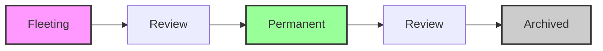

# Note Lifecycle

Your agent's memory isn't static. It evolves. In `open-zk-kb`, notes move from quick captures to validated knowledge, keeping your context lean and relevant. Older notes stay searchable when you need the history.

## Why one concept per note?

Each note in open-zk-kb captures a single idea. This "atomic note" approach (inspired by the [Zettelkasten method](https://en.wikipedia.org/wiki/Zettelkasten)) is particularly effective for agents:

- **Precise retrieval** — search returns exactly what's relevant, not a wall of loosely related text
- **Keeps context lean** — 10 focused notes cost far fewer tokens than a 500-line rules file where 90% is irrelevant
- **Independent aging** — one note can be promoted or archived without affecting others
- **Composability** — small typed notes combine naturally across searches to build a complete picture

## The Three Statuses

Every note in the system exists in one of three states:

1.  **Fleeting**: Quick captures, first thoughts, or context-specific snippets. Think of these as the inbox for your knowledge base. They surface for review often so you can promote what matters and retire what doesn't.
2.  **Permanent**: Validated knowledge your agent should keep close. These notes have proven useful through repeated access or anchor your workflow, like architectural decisions.
3.  **Archived**: Notes you don't need in active rotation anymore, but still want for history. They leave the main review queue and stay fully searchable.

## Note Kinds & Defaults

When a note is created, its `kind` determines its initial `status`. Some kinds are inherently stable (Permanent), while others are expected to evolve or expire (Fleeting).

| Kind | Default Status | Description |
| :--- | :--- | :--- |
| `personalization` | **Permanent** | User preferences, habits, and personal style. |
| `reference` | **Fleeting** | Technical facts, API details, and documentation snippets. |
| `decision` | **Permanent** | Architectural choices, project commitments, and trade-offs. |
| `procedure` | **Fleeting** | Step-by-step workflows and recurring tasks. |
| `resource` | **Permanent** | Stable links, tools, libraries, and external documentation. |
| `observation` | **Fleeting** | Insights, patterns, and temporary findings. |
| `domain` | **Permanent** | Project operating manuals for agent role, scope, conventions, and boundaries. |
| `index` | **Permanent** | Auto-generated project catalog used mainly as a human-facing navigation surface in Obsidian. |
| `log` | **Permanent** | Auto-generated project activity history used mainly as a human-facing activity surface in Obsidian. |

`index` and `log` are special structural notes. They are server-generated, not manually authored via `knowledge-store`, and may contain richer Obsidian-specific UX than core knowledge notes.

## The Review System

To prevent knowledge rot, `open-zk-kb` uses a review system to surface notes that need attention. This is managed via the `knowledge-maintain review` tool.

### How it Works
The system analyzes two primary signals to generate review recommendations:
- **Age**: How long has it been since the note was created or last reviewed? (`reviewAfterDays`)
- **Utility**: How many times has this note been accessed? (`promotionThreshold`)

### Review Recommendations
- **Promote**: A fleeting note that has high utility (accessed > `promotionThreshold`) is recommended for promotion to **Permanent**.
- **Archive**: A note that is old (> `reviewAfterDays`) and has low utility is recommended for **Archived** status.
- **Review**: Notes that fall into ambiguous territory are flagged for manual inspection.

> [!IMPORTANT]
> **Nothing is automatic.** The review system is advisory. You or your agent must explicitly act on recommendations using `knowledge-maintain promote` or `knowledge-maintain archive`.

### Exemptions
Certain kinds of knowledge (like `personalization` and `decision`) are often exempt from the standard review cycle to ensure they are always available in active context. These are defined in the `exemptKinds` configuration.

## Visual Flow

The lifecycle follows a linear progression of validation:



**Note**: Archived notes are **NOT** deleted. They are simply retired from active use to keep your "hot" context lean and relevant. They remain indexed and searchable at any time.

## Configuration

You can tune the lifecycle behavior in your `config.yaml` file:

```yaml
lifecycle:
  reviewAfterDays: 14      # Days until a note is flagged for review
  promotionThreshold: 2    # Access count required to suggest promotion
  exemptKinds:             # Kinds that skip the review queue
    - personalization
    - decision
```

For a full list of configuration options, see the [Configuration Reference](configuration.md). The review system is exposed through the [`knowledge-maintain` tool](tools-reference.md#knowledge-maintain).
