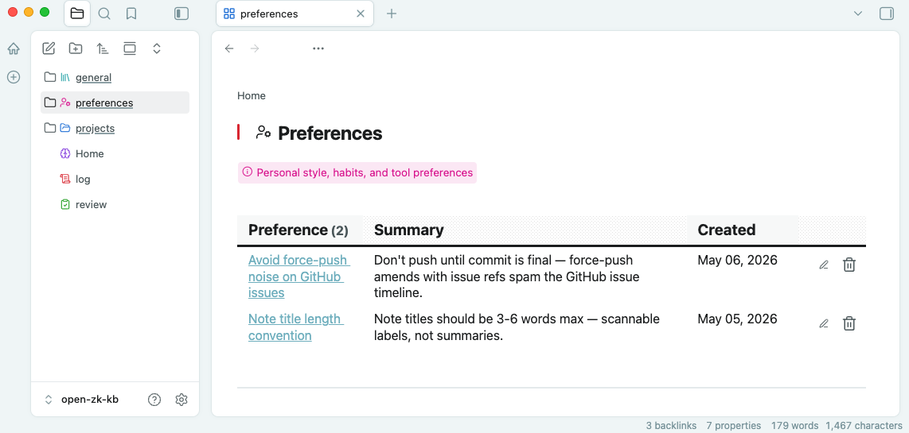

# Obsidian Guide

Your knowledge base is a fully functional [Obsidian](https://obsidian.md) vault. The [`knowledge-open`](tools-reference.md#knowledge-open) MCP tool launches it with a managed scaffold that configures a theme, plugins, navigation, and styling — no manual setup required.

For installation, see the [Setup Guide](setup-guide.md). For configuration options, see the [Obsidian Vault Scaffold](configuration.md#obsidian-vault-scaffold) section. Notes are organized into [9 kinds with lifecycle management](note-lifecycle.md).

## Getting Started

Call `knowledge-open` from any MCP client, or run the CLI directly:

```bash
bunx open-zk-kb@latest open
```

On first launch the scaffold creates the `.obsidian/` directory with all plugins, theme, snippets, and settings. Subsequent launches auto-upgrade pinned assets unless `obsidian.autoUpgrade: false` is set in `config.yaml`.

## What You Get

<p align="center">
  
  <br>
  <sub>Homepage dashboard with project stats and navigation</sub>
</p>

### Homepage Dashboard

The vault opens to a **Home** page showing:

- Total note and project counts
- Project table with note counts and last-active dates
- Links to General Knowledge, Preferences, Review queue, and Operations Log

### Breadcrumb Navigation

Every page displays a breadcrumb trail at the top, powered by the [Breadcrumbs](https://github.com/SkepticMystic/breadcrumbs) plugin. Folder notes declare `BC-folder-note: true` and `up:` links in their frontmatter to build the hierarchy:

```
Home > Projects > my-project > Decisions
```

### Kind-Based Organization

Notes are organized into directories by kind, each with a distinct icon and color:

| Kind | Icon | Color |
|------|------|-------|
| Decisions | scale | orange |
| Procedures | list-checks | green |
| References | book-open | blue |
| Observations | lightbulb | yellow |
| Resources | external-link | cyan |
| Preferences | user-cog | pink |
| Domain | compass | purple |

Icons appear in the sidebar (via [Iconic](https://github.com/gfxholo/iconic)) and in page headings (via [Inline Callouts](https://github.com/gapmiss/inline-callouts)).

<p align="center">
  
  <br>
  <sub>Breadcrumb trail, kind icon, description callout, and action buttons</sub>
</p>

### Inline Action Buttons

Dataview tables on navigation pages include action buttons for each note:

| Button | Action |
|--------|--------|
| pencil | Edit via QuickAdd |
| trash | Delete (with confirmation) |
| check-circle | Promote to permanent (review page only) |
| + | Add new note of that kind (section headers) |

### Review Queue

The `review.md` page lists all fleeting notes grouped by project, with promote, edit, and delete actions. It regenerates automatically when notes are stored.

## Managed Plugins

The scaffold installs and configures 14 plugins:

| Plugin | Purpose |
|--------|---------|
| [Dataview](https://github.com/blacksmithgu/obsidian-dataview) | Dynamic tables and lists on navigation pages |
| [Breadcrumbs](https://github.com/SkepticMystic/breadcrumbs) | Hierarchical breadcrumb trails |
| [Homepage](https://github.com/mirnovov/obsidian-homepage) | Opens Home on launch |
| [QuickAdd](https://github.com/chhoumann/quickadd) | Templated note creation and editing |
| [Templater](https://github.com/SilentVoid13/Templater) | Template engine for QuickAdd |
| [Iconic](https://github.com/gfxholo/iconic) | Per-kind file/folder icons and colors |
| [Inline Callouts](https://github.com/gapmiss/inline-callouts) | Icon + text callouts in headings and descriptions |
| [Meta Bind](https://github.com/mProjectsCode/obsidian-meta-bind-plugin) | Interactive buttons on navigation pages |
| [Commander](https://github.com/phibr0/obsidian-commander) | Ribbon and page-header button management |
| [Style Settings](https://github.com/mgmeyers/obsidian-style-settings) | Theme configuration (card layout) |
| [File Name Styler](https://github.com/Trikzon/obsidian-file-name-styler) | Hides 16-digit Zettelkasten ID prefixes in the sidebar |
| [Border Theme](https://github.com/Akifyss/obsidian-border) | Clean visual theme |

All plugin versions are pinned and managed by the scaffold. Manual changes to managed plugins are overwritten on upgrade.

> **Note**: The scaffold fully replaces configuration for QuickAdd, Commander, Templater, Breadcrumbs, and Iconic on each upgrade to keep navigation and actions consistent. Custom QuickAdd macros, Commander buttons, or Iconic rules added manually will be overwritten. Add custom automation in non-managed plugins or separate QuickAdd profiles.

## Navigation Structure

```
Home.md                          # Global dashboard
├── projects/
│   ├── projects.md              # Projects index
│   └── <project>/
│       ├── <project>.md         # Project index (kind sections)
│       ├── decisions/           # Kind sub-directories
│       ├── procedures/
│       ├── references/
│       ├── observations/
│       └── resources/
├── general/
│   ├── general.md               # Unscoped notes index
│   └── <kind>s/                 # Kind sub-directories
├── preferences/
│   └── preferences.md           # Personalization notes
├── log.md                       # Global operations log
└── review.md                    # Fleeting notes review queue
```

Folder notes (e.g., `projects/projects.md`) act as landing pages for their directories. The Breadcrumbs plugin uses these to build navigation trails.

## CSS Snippets

The scaffold manages several CSS snippets in `.obsidian/snippets/`:

| Snippet | Purpose |
|---------|---------|
| `zk-tables` | Full-width tables, action button styling, alternating row colors |
| `zk-nav` | Breadcrumb trail styling (minimal, borderless) |
| `zk-dashboard` | Homepage layout, heading spacing, inline title hiding |
| `zk-icons` | Sidebar icon adjustments, inline callout spacing |
| `zk-metadata` | Hides metadata in reading view |
| `zk-properties` | Compact collapsible properties in edit view |
| `readonly-kb` | Read-only styling (when `obsidian.readOnly: true`) |

## Configuration

Three settings in `config.yaml` control the Obsidian scaffold:

```yaml
obsidian:
  scaffold: true       # Create/merge .obsidian/ directory (default: true)
  autoUpgrade: true    # Refresh plugin/theme assets on launch (default: true)
  readOnly: true       # Read-only mode with protective styling (default: true)
```

Set `readOnly: false` if you want to edit notes directly in Obsidian rather than through MCP tools.

## Design Principles

- **Core notes stay markdown-native** — no Obsidian-specific markup in knowledge notes (decisions, procedures, references, etc.)
- **Navigation notes can be richer** — `index`, `log`, and `review` files use Dataview, Inline Callouts, and plugin metadata because they are human-facing surfaces
- **Server generates, Obsidian renders** — the MCP server owns shell file creation and structural guarantees; Dataview and plugins own the presentation layer
- **Scaffold is declarative** — managed files are overwritten on upgrade; user customizations should go in non-managed snippets or plugin settings

For the full ownership model, see [Architecture](architecture.md#ownership-boundaries).
