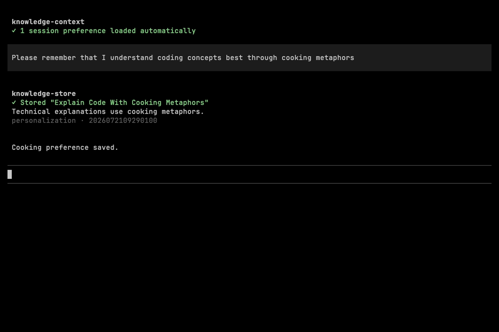
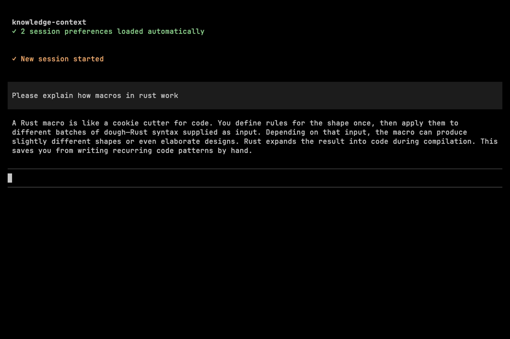
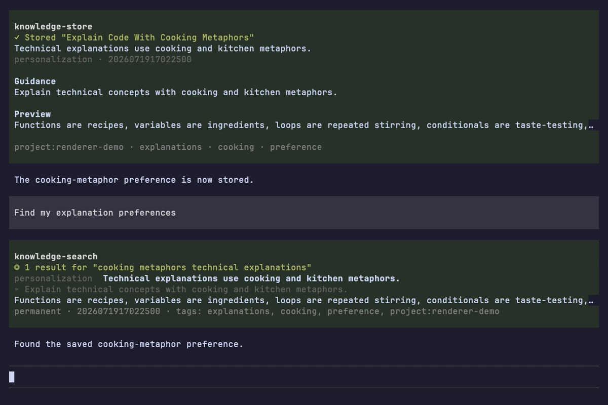
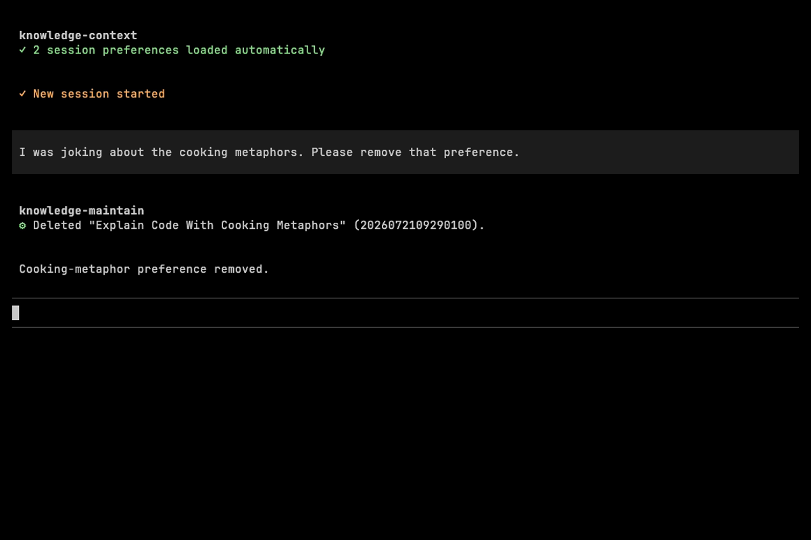

# Pi Experience

open-zk-kb ships as a native [Pi package](https://github.com/badlogic/pi-mono). It bridges the Bun-powered MCP server into Pi's tool system, preserves complete results for the model, and renders focused summaries for humans.

[Watch the complete 47-second demo](../assets/pi-demo.mp4), or install the package:

```bash
pi install npm:open-zk-kb
```

Bun remains required for the local MCP server and SQLite storage. Restart Pi after installation. The direct `pi install` command does not run open-zk-kb's interactive telemetry consent prompt, so sharing remains disabled unless it was configured separately or Pi was installed through `bunx open-zk-kb@latest`.

## Automatic Project Preferences

When a Pi session starts, the extension derives the canonical project from the current working-directory basename and loads permanent preferences through `knowledge-context`. It supplies that project and `client: "pi"` on every routine stored-knowledge call it initiates; caller-supplied values cannot widen the boundary. The preference capsule enters model context through the system prompt, so it is available before the model responds and does not require a model-initiated `knowledge-search` call.

Pi separately displays an honest, deduplicated session entry:

```text
knowledge-context
✓ 2 session preferences loaded automatically
```

This entry reports extension activity; it does not pretend that the model requested a tool call. Expand it to inspect the scopes and guidance that were loaded.

## Store a Preference

The agent stores one durable concept as a structured personalization note. Pi shows the title, summary, kind, and note ID while the complete server response remains available to the model.

<p align="center">
  <a href="../assets/pi-preference-store.png"></a>
</p>

## Apply It in a Fresh Session

After `/new`, Pi automatically loads both the project preference and the newly stored cooking-metaphor preference. The Rust explanation applies the preference without a search call.

<p align="center">
  <a href="../assets/pi-preference-application.png"></a>
</p>

## Inspect Knowledge Base Health

`knowledge-health` summarizes scale and maintenance quality without flooding the terminal. This example contains 240 permanent notes across five knowledge kinds, complete embedding coverage, and healthy links.

<p align="center">
  <a href="../assets/pi-demo.png"></a>
</p>

## Remove a Preference

Preferences remain ordinary Markdown-backed knowledge notes. The agent can delete one through `knowledge-maintain`, and the next session refreshes its preference capsule.

<p align="center">
  <a href="../assets/pi-preference-removal.png"></a>
</p>

## Native Tool Rendering

The package registers all ten `knowledge-*` tools directly in Pi:

- `knowledge-store`, `knowledge-search`, `knowledge-get`, and `knowledge-template`
- `knowledge-context`, `knowledge-health`, and `knowledge-maintain`
- `knowledge-mine`, `knowledge-ingest`, and `knowledge-open`

Pi retains its native tool header and interaction shell. open-zk-kb supplies only knowledge-specific result content, with compact collapsed states and expanded detail where useful. Malformed responses and server errors fall back to complete raw output instead of hiding diagnostic information.

For installation and troubleshooting, see the [Setup Guide](setup-guide.md#pi-installation). For tool parameters and response behavior, see the [Tools Reference](tools-reference.md).


## Project boundaries

Pi routine searches, exact-ID retrieval, context, health note metrics, stores, and mining operate on the current project plus explicitly global notes. Stores and mined notes remain project-local; normal calls cannot create global or unclassified notes. Maintenance remains full-vault and does not receive an implicit project restriction from the extension. Use maintenance to inventory legacy unclassified notes and to preview `publish-global`; show the evidence and obtain explicit confirmation before creating a project-agnostic derivative.
